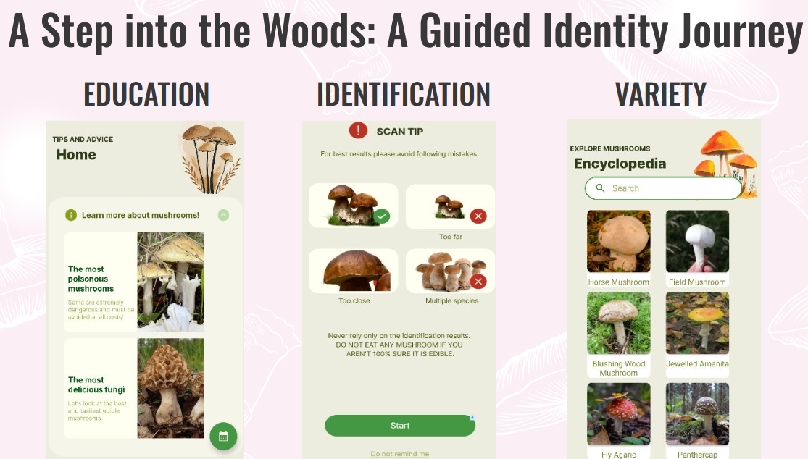

# ChantarelleCheck - The ultimate Mushroom Helper

## Overview

My **bachelor degree project**, which is centered around the development of a mobile android application for *automatic mushroom identification using machine learning*.
The **purpose** of this project is to empower users to safely and accurately identify mushrooms they encounter in their natural environment.
image

## Research tasks

 - [x] Analysis of the need for accurate mushroom identification.
 - [x] Examination of existing applications for mushroom identification.
 - [x] Design of the mobile application.
 - [x] Development and testing of a mobile application prototype.
 - [x] Usage of Android Studio with Java to extend proramming language knowledge. 

 
 ## How to use
This project is built with Gradle 8.2.2, Android min SDK 26 and target 34  and Java 8. To get started:
- Run gradle sync
- Run the application on the preferred android device 

## TODOs for myself

-  To implement unit tests to ensure code reliability.
-  To add more classes for the classification model.
-  To add more images for classes to ensure the model liability.
-  To add possibility of static image classification.
- To add findings feature (all the current findings on the pre downloaded map).
- To clean layout files

## Inspiration

Spending quality time with family and finding a shared activity that fosters connection and enjoyment can be a beautiful challenge. In our family, mushroom hunting has become a cherished pastime. It allows us to connect with nature, learn about the fascinating world of fungi, and create lasting memories together. However,
accurately identifying mushrooms, especially for beginners, can be a daunting task. This ever-present challenge sparked an idea: what if I could create a tool that could assist us in our mushroom hunting adventures, a reliable companion that could empower us to confidently explore the world of fungi? Build on top of the educational examples of using Tensorflow Lite for image classification. 
